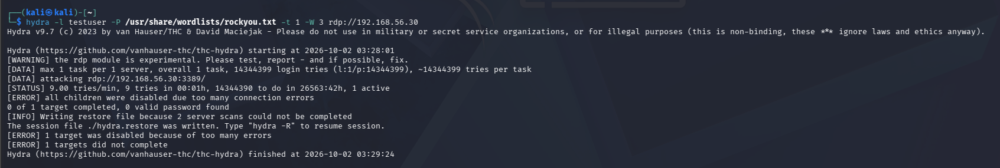
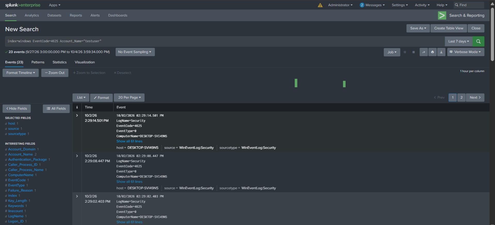
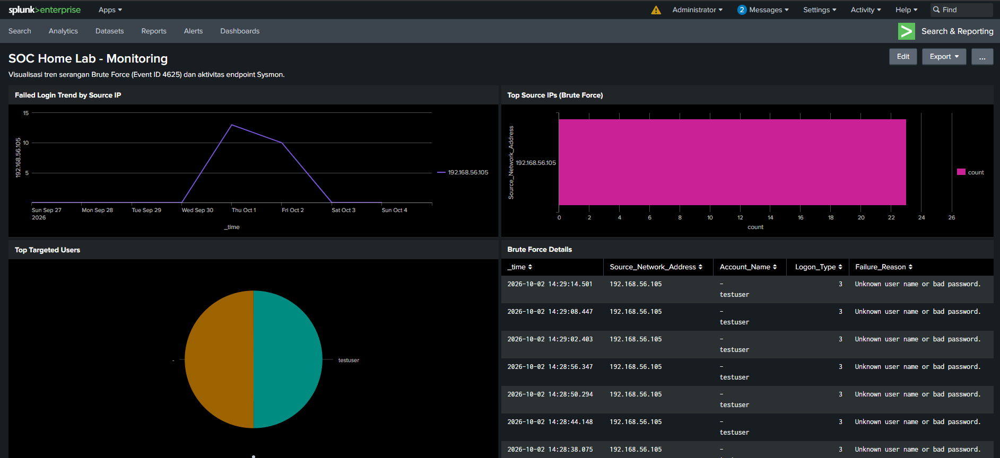

# Live Attack 1 - Brute Force Attack

## Overview

Brute force attack against an RDP service on Windows 10, run to check whether Sysmon and Splunk actually catch it.

| Field | Value |
|---|---|
| Attack type | Brute Force (RDP) |
| Attacker | Kali Linux (192.168.56.105) |
| Target | Windows 10 (192.168.56.30) |
| Target user | testuser |
| Tool | Hydra |
| Event ID | 4625 (Logon Type 3) |
| MITRE ATT&CK | T1110 |

---

## Attack Simulation

### Command

```bash
hydra -l testuser -P /usr/share/wordlists/rockyou.txt -t 1 -W 3 rdp://192.168.56.30
```

### Result

Hydra didn't crack the password, but that was never the point. The attempts generated multiple Event ID 4625 (failed login) entries on the Windows 10 target.



---

## Detection

### Splunk query (SPL)

```spl
index=windows EventCode=4625
| stats count by Source_Network_Address, Account_Name
| where count > 5
```

### Result

Clear spike in failed logins from 192.168.56.105, all aimed at `testuser`.



---

## Dashboard

Panels built for this lab:

- Failed login trend by source IP
- Top source IPs (brute force)
- Top targeted users
- Brute force detail view



---

## Incident Report

Full writeup, including analyst notes and the escalation decision, is in [incident-report.md](incident-report.md) (INC-2026-001).

---

Part of the [SOC Home Lab - Splunk & Sysmon](https://github.com/adiirmdhn/SOC-Home-Lab-Splunk) project.
